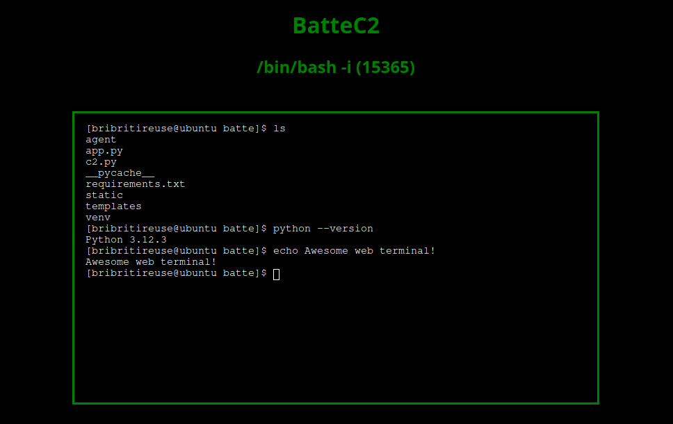

# BatteC2

*A Python-based command and control framework for red teams with a fancy web UI*
**Work in progress**

## Features

- Simple, hackable and secure
- Complete web terminal for agent control with mutli-process support
- Multiplexed file exfiltration
- Control an unlimited number of agents simultaneously
- Efficient kill-switch
- Superb web UI

## In coming...

- Encryption
- File browsing

